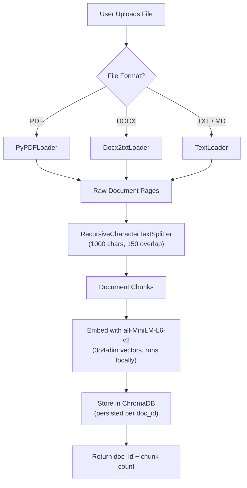
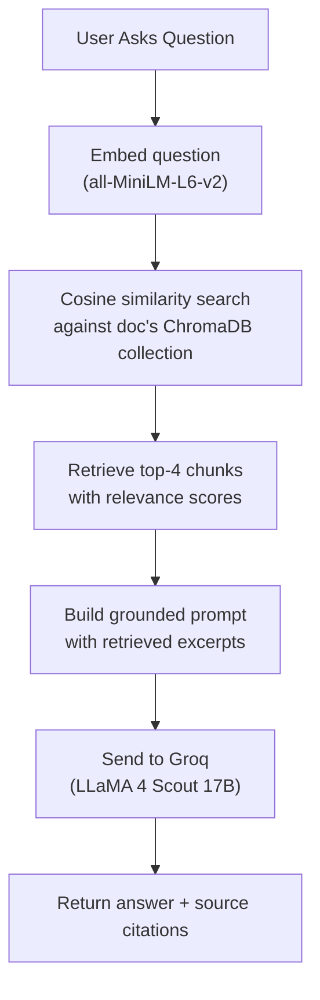
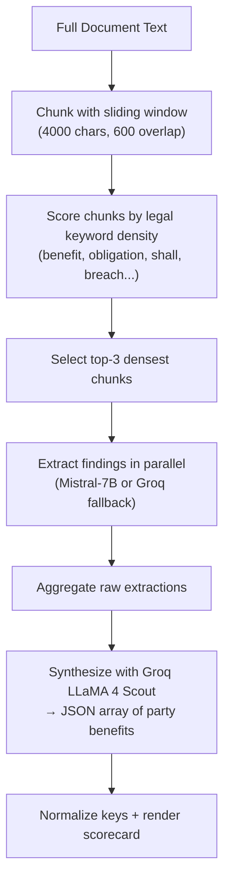

# ContractIQ 📄✨

> **AI-powered real estate contract auditing** with a full Retrieval-Augmented Generation (RAG) pipeline.
> Upload any lease, deed, or legal agreement and get instant plain-English analysis powered by semantic search and LLM generation.
>
> 🚀 **Live Demo**: [https://contract-iq-theta.vercel.app/](https://contract-iq-theta.vercel.app/)

---

## 📸 Screenshots

<div align="center">
  
  <p><em>Premium brutalist intro with Outfit 900 typography</em></p>

  <br />

  
  <p><em>Dual-party benefits scorecard with interactive bar graphs</em></p>

  <br />

  
  <p><em>AI chat terminal — full-screen mode with source citations</em></p>
</div>

---

## 🏗️ Architecture

ContractIQ runs as a **two-service stack**:

| Service | Host | Role |
|---------|------|------|
| **Python FastAPI Backend** | [Render](https://render.com) (free tier) | Document parsing, embedding, vector search, LLM generation |
| **Next.js Frontend** | [Vercel](https://vercel.com) | UI, file upload, benefits analysis pipeline |

```
┌─────────────────────┐
│   User's Browser    │
└─────────┬───────────┘
          │
          ▼
┌─────────────────────────────────────────┐
│   Vercel (Next.js Frontend)             │
│                                         │
│   • Upload UI + Chat UI                 │
│   • /api/chat  → Benefits analysis      │
│     (Groq direct — no vector search)    │
│   • /api/extract → PDF/DOCX parsing     │
│     (fallback for local-only mode)      │
└─────────┬───────────────────────────────┘
          │  POST /upload, POST /chat
          ▼
┌─────────────────────────────────────────┐
│   Render (Python FastAPI Backend)       │
│                                         │
│   • sentence-transformers               │
│     (all-MiniLM-L6-v2, runs locally)    │
│   • ChromaDB (in-memory vector store)   │
│   • LangChain RAG pipeline              │
│   • Groq API (LLaMA 4 Scout 17B)       │
└─────────────────────────────────────────┘
```

---

## 🔍 RAG Pipeline — How It Works

The backend implements a **real** RAG pipeline with semantic embeddings and vector similarity search, replacing the earlier keyword-density approach.

### 1. Document Ingestion (`POST /upload`)



**Key details:**
- **Chunking**: `RecursiveCharacterTextSplitter` with 1000-char windows and 150-char overlap, splitting on `\n\n`, `\n`, `. `, ` `
- **Embeddings**: `sentence-transformers/all-MiniLM-L6-v2` — 384-dimensional vectors, runs entirely on-device (no API calls)
- **Storage**: ChromaDB with a separate collection per `doc_id`, persisted to disk

### 2. Question Answering (`POST /chat`)



**Key details:**
- **Retrieval**: Top-4 chunks by cosine similarity (Chroma default distance metric)
- **Grounding**: The LLM prompt includes only the retrieved excerpts — it cannot hallucinate from data it hasn't seen
- **Citations**: Each response includes source excerpts with relevance scores (0-1)

### 3. Benefits Analysis Pipeline (Vercel `/api/chat`)

The benefits scorecard runs through a **separate pipeline** on Vercel, without vector search:



---

## 🛠️ Tech Stack

| Layer | Technology |
|-------|------------|
| **Frontend** | Next.js 14 (App Router), TypeScript, Tailwind CSS |
| **Backend** | Python 3.11, FastAPI, LangChain |
| **Embeddings** | `sentence-transformers/all-MiniLM-L6-v2` (local, free) |
| **Vector Store** | ChromaDB (on-device) |
| **LLM (RAG)** | LLaMA 4 Scout 17B via Groq API |
| **LLM (Benefits)** | Mistral-7B-Instruct (HuggingFace) → Groq fallback |
| **Parsing** | PyPDFLoader, Docx2txtLoader (backend) / pdf-parse, mammoth (frontend) |
| **Deployment** | Render (backend Docker) + Vercel (frontend) |

---

## 📂 Project Structure

```
contractIQ/
├── contractiq-backend/              # Python RAG backend (deployed to Render)
│   ├── Dockerfile                   # Docker build — pre-downloads embedding model
│   ├── main.py                      # FastAPI server: /upload, /chat, /health
│   ├── rag_pipeline.py              # Full RAG: ingest → embed → search → generate
│   ├── requirements.txt             # Python dependencies
│   └── .env.example                 # Backend env var docs
│
├── src/                             # Next.js frontend (deployed to Vercel)
│   ├── app/
│   │   ├── api/
│   │   │   ├── chat/route.ts        # Benefits analysis pipeline (Mistral + Groq)
│   │   │   └── extract/route.ts     # PDF/DOCX text extraction (fallback)
│   │   ├── page.tsx                 # Main UI — upload, chat, scorecard
│   │   ├── layout.tsx               # Fonts (Outfit/Inter) + metadata
│   │   └── globals.css              # Custom cursor, frosted glass, animations
│   └── lib/
│       ├── huggingface.ts           # Mistral-7B chunk extraction + text chunking
│       └── groq.ts                  # Groq API wrapper with retries + context retrieval
│
├── render.yaml                      # Render Blueprint (one-click deploy)
├── .env.example                     # Frontend env var docs
├── package.json
├── tailwind.config.js
└── tsconfig.json
```

---

## 💻 Getting Started

### Prerequisites

- **Node.js 18+** (for the frontend)
- **Python 3.11+** (for the backend)
- **Groq API Key** (free): [console.groq.com/keys](https://console.groq.com/keys)
- **HuggingFace API Key** (optional, for Mistral benefits extraction): [huggingface.co/settings/tokens](https://huggingface.co/settings/tokens)

### 1. Clone & Setup

```bash
git clone https://github.com/ISHAN12369/contractIQ.git
cd contractIQ
```

### 2. Start the Backend

```bash
cd contractiq-backend
pip install -r requirements.txt
cp .env.example .env
# Edit .env and add your GROQ_API_KEY
uvicorn main:app --reload --port 8000
```

The first run will download the embedding model (~80MB) — subsequent starts are instant.

### 3. Start the Frontend

```bash
# From the repo root
npm install
cp .env.example .env
# Edit .env: set GROQ_API_KEY, optionally HF_API_KEY
# NEXT_PUBLIC_RAG_API_URL is already set to http://localhost:8000
npm run dev
```

Open [http://localhost:3000](http://localhost:3000) in your browser.

---

## ☁️ Deployment

### Backend → Render

1. Create a **Web Service** on [Render](https://dashboard.render.com)
2. Connect your GitHub repo, set **Root Directory** to `contractiq-backend`
3. Select **Docker** runtime, **Free** plan
4. Add env var: `GROQ_API_KEY`
5. Deploy — wait ~5-10 min for Docker build

### Frontend → Vercel

1. Import your GitHub repo on [Vercel](https://vercel.com)
2. Add environment variables:
   - `GROQ_API_KEY` — for benefits analysis
   - `NEXT_PUBLIC_RAG_API_URL` — your Render backend URL (e.g. `https://contractiq-backend.onrender.com`)
3. Deploy

> **Note**: Render free tier spins down after 15 min of inactivity. First request after sleep takes ~30-60s. Uploaded documents' vector stores are lost on restart — users re-upload each session.

---

## 🎨 Design Philosophy

- **Kinetic Brutalist Aesthetic**: Inspired by `wonjyou.studio` — high-contrast panels, uppercase typography, dynamic text masking
- **Widescreen Optimization**: 95% screen width utilization with side-by-side panels
- **Mathematical Fairness Checking**: Computes benefit ratios between parties to flag one-sided contracts
- **Privacy First**: Documents are parsed in-memory with no persistent storage

---

## 🔒 Privacy

- Documents are processed in-memory only — **zero long-term data persistence**
- Vector stores exist only for the duration of the Render instance uptime
- No telemetry, analytics, or third-party cookies
- API keys are stored server-side via environment variables

---

## 📄 License

MIT License — feel free to fork, modify, and utilize.
