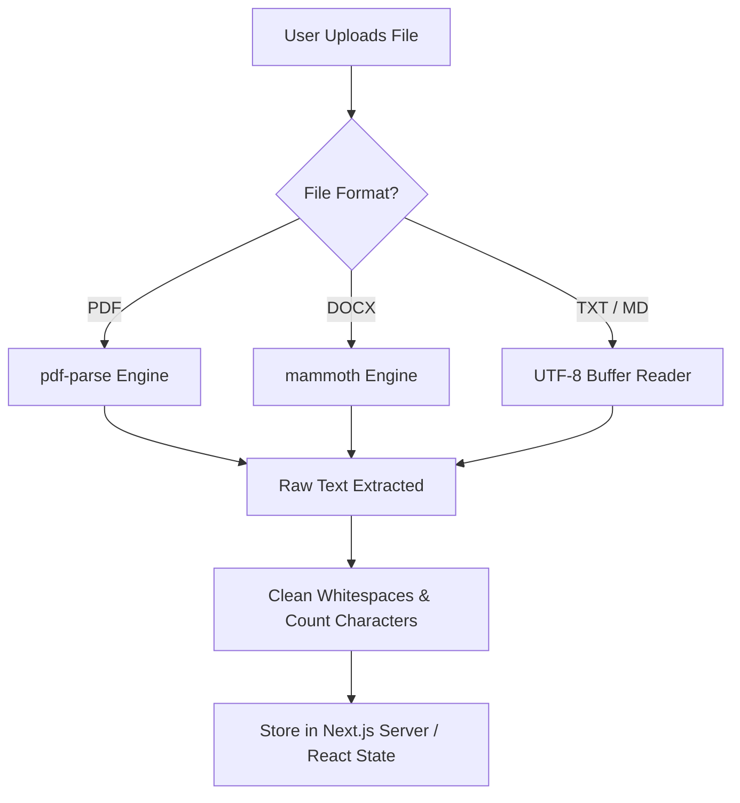
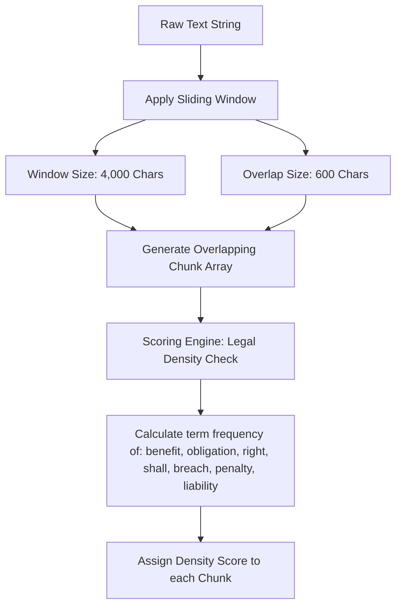
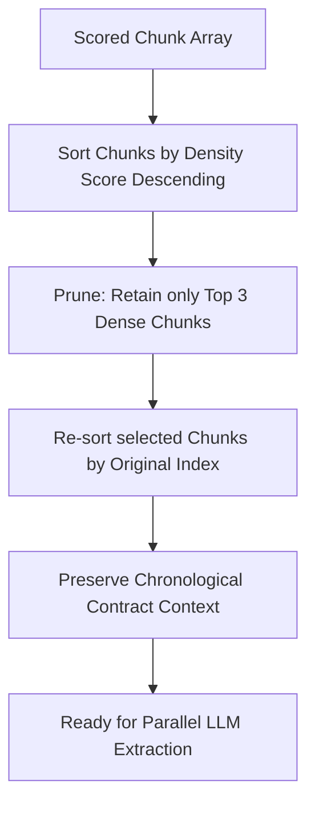
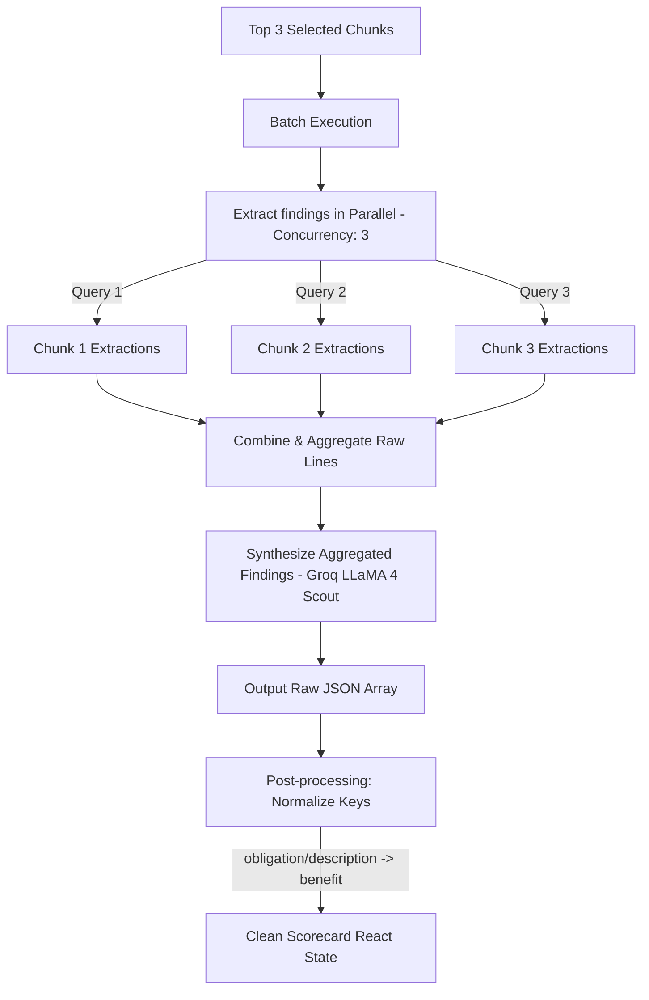

# ContractIQ 📄✨

> **ContractIQ** is a premium, high-fidelity real estate contract auditing tool. Redesigned with a bold, kinetic brutalist layout inspired by the `wonjyou.studio` design system, it alternates between pitch-black and warm cream themes with dynamic text masking, scrolling marquees, and a custom mouse cursor.
>
> 🚀 **Live Demo**: [https://contract-iq-theta.vercel.app/](https://contract-iq-theta.vercel.app/)

Understand lease agreements, purchase deeds, and legal terms instantly—in plain English—using a dual-AI pipeline: **Mistral-7B-Instruct** (HuggingFace) for chunk-level extraction and **LLaMA 4 Scout** (Groq) for ultra-fast synthesis.

---

## 📸 Screenshots

<div align="center">
  
  <p><em>Premium brutalist intro section with Outfit 900 typography</em></p>
  
  <br />
  
  
  <p><em>Widescreen dual-party benefits graph, links, and audit scores (rounded corners)</em></p>
  
  <br />
  
  
  <p><em>Widescreen AI chat terminal morphed into full screen mode</em></p>
</div>

---

## 🏆 Why ContractIQ is Better

Unlike generic PDF parsers or standard ChatGPT wrappers, **ContractIQ** is specifically optimized for real-world legal auditing and a premium user experience:

- **10x Faster Audit Cycles (Relevance-focused)**: Instead of forcing you to read a 10,000-word contract, the viewer filters and lists **only** the key clauses related to identified benefits. Selecting any point instantly scrolls and highlights that exact clause in the contract body.
- **Dynamic Morphing Interface**: The layout shifts fluidly. If you click on a quick auditor obligation topic, the options drawer collapses, and the chat console automatically expands into a full-width focus mode.
- **Widescreen Screen Optimization**: Utilizes 95% of screen width to show graphs, text lists, and chat panels side-by-side, preventing continuous vertical scrolling.
- **Mathematical Fairness Checking**: Computes the exact ratio of benefit values to ensure legal terms are not heavily weighted in favor of only one party (e.g. Landlord vs Tenant).

---

## 🎨 Key Features

- **wonjyou.studio Aesthetic**: Rich, high-contrast panels, uppercase kinetic typography, and unique mouse tracking effects.
- **Widescreen Responsive Grid**: Layout elements stretch dynamically to utilize 95% of screen width.
- **AI Balance Scorecard**: Automatically parses the contract to extract the top benefits for both parties, plotting them as interactive gradient-filled bar graphs.
- **Connect Benefit Links**: Under-graph text link indices that instantly focus and scroll to the matching clause.
- **Frosted Glass Contract Viewer**: A collapsible bottom console (`backdrop-filter: blur(16px)`) displaying relevant key clauses that dynamically highlights active selections.
- **Privacy First**: Files are parsed in-memory (no databases), and HuggingFace API tokens are stored strictly in client-side localStorage.

---

## 🔍 AI Pipeline & Flowcharts (Preprocessing & Chunking)

ContractIQ uses a high-performance, multi-layered processing pipeline to parse, segment, filter, and extract insights from large legal contracts in under 3 seconds. Below is the end-to-end flowchart of the preprocessing, semantic chunking, context pruning, and concurrent extraction process.

### 1. Document Preprocessing & Text Extraction Flow
Converts raw binary/text files into clean normalized string representations in memory:


### 2. Semantic Chunking & Overlapping Windows
Segments the raw contract text into context-retaining blocks using a sliding window:


### 3. Relevance Filtering & Context Pruning
Filters and sorts chunks to stay well within Groq rate limits and process only legal-dense clauses:


### 4. Parallel Insights Extraction & JSON Synthesis
Runs batch execution on Groq LLaMA 4 Scout, compiles the results, and normalizes findings:


---

## 🛠️ Tech Stack

| Layer | Technology |
|---|---|
| **Framework** | Next.js 14 (App Router) |
| **Language** | TypeScript |
| **Styling** | Vanilla CSS + Tailwind configuration |
| **Icons** | Lucide React |
| **Chunk Extraction** | Mistral-7B-Instruct-v0.3 (HuggingFace) / LLaMA 4 Scout (Groq fallback) |
| **Answer Generation** | LLaMA 4 Scout 17B (via Groq API) |
| **Parsing Engine** | `pdf-parse` (PDF) & `mammoth` (DOCX) |

---

## 💻 Getting Started

### 1. Clone & Setup

```bash
git clone https://github.com/ISHAN12369/contractIQ.git
cd contractIQ
npm install
```

### 2. Configure API Keys

Copy `.env.example` to `.env` and fill in your API keys:

```bash
cp .env.example .env
```

- **HuggingFace API Key** (free): [huggingface.co/settings/tokens](https://huggingface.co/settings/tokens)
- **Groq API Key** (free): [console.groq.com/keys](https://console.groq.com/keys)

Once keys are configured in `.env`, users do **not** need to enter any API keys in the UI.

### 3. Run Locally

```bash
npm run dev
```

Open [http://localhost:3000](http://localhost:3000) in your browser.

---

## ☁️ Deployment

### 1-Click Deployment (Recommended)

Vercel is the native host for Next.js, compiling your API functions automatically.

[](https://vercel.com/new/clone?repository-url=https://github.com/ISHAN12369/contractIQ)

### Manual Deployment

```bash
npm i -g vercel
vercel
```

---

## 📂 Project Structure

```
contractIQ/
├── src/
│   ├── app/
│   │   ├── api/
│   │   │   ├── chat/route.ts      # Orchestrates chunk extraction (Mistral) → synthesis (Groq)
│   │   │   └── extract/route.ts   # Parses PDF/DOCX uploads
│   │   ├── page.tsx               # Main visual template
│   │   ├── layout.tsx             # Document head & Outfit/Inter font imports
│   │   └── globals.css            # Custom cursor, scrolling ticker, frosted glass styles
│   └── lib/
│       ├── huggingface.ts         # Mistral-7B chunk extraction + text chunking utility
│       └── groq.ts                # Groq API (LLaMA 3.1) synthesis & chat
├── package.json
└── tailwind.config.js
```

---

## 🔒 Privacy & Terms

- Documents are parsed strictly in serverless memory. **Zero data persistence**.
- No telemetry, analytics trackers, or third-party cookies.
- Direct connections from your browser/serverless route to HuggingFace.

---

## 📄 License

MIT License — feel free to fork, modify, and utilize.
