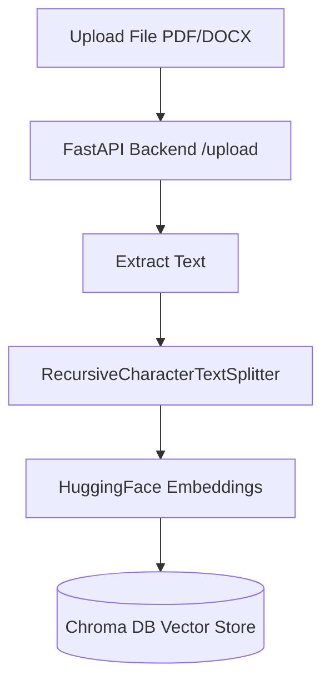
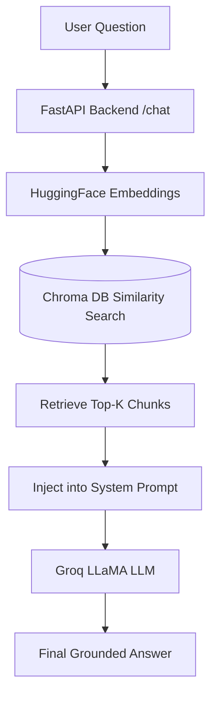
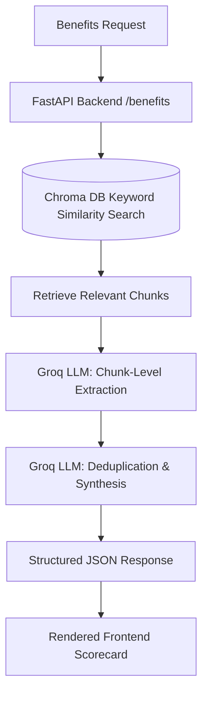

# ContractIQ 📄⚖️

**ContractIQ** is a modern, AI-powered legal contract analysis platform. It leverages a fully unified Python-based Retrieval-Augmented Generation (RAG) backend and a sleek Next.js frontend to instantly parse, index, and analyze complex legal documents (PDF, DOCX, TXT).

🌍 **[Live Demo](https://contract-iq-theta.vercel.app)** 

---

## 📸 Screenshots


---

## 🏗️ Architecture & Pipelines

The application is split into a robust **Next.js frontend** and a high-performance **Python FastAPI backend**. The entire AI pipeline (including RAG and complex document analysis) is unified within the Python backend, ensuring a clean separation of concerns.

### 1. Document Ingestion Pipeline 📥
When a user uploads a document, the following pipeline executes:
1. **Extraction**: The frontend extracts raw text (using `pdf-parse` or `mammoth` for DOCX) for instant UI preview.
2. **Chunking**: The original file is sent to the FastAPI backend, where LangChain's `RecursiveCharacterTextSplitter` breaks the text into semantically cohesive chunks.
3. **Embedding**: Each chunk is embedded locally using HuggingFace's `sentence-transformers/all-MiniLM-L6-v2` (free, fast, and completely local).
4. **Vector Storage**: Embeddings are stored in a persistent **Chroma DB** collection, keyed by a unique Document ID.



### 2. General RAG Chat Pipeline 💬
Users can ask open-ended questions about their uploaded contracts:
1. **Query Embedding**: The user's question is embedded using the same HuggingFace model.
2. **Similarity Search**: Chroma DB retrieves the top-K most relevant chunks based on cosine similarity.
3. **Context Grounding**: The retrieved chunks are injected into a strict system prompt.
4. **Generation**: The grounded prompt is sent to **Groq** (running `meta-llama/llama-4-scout-17b-16e-instruct`), which generates an accurate, hallucination-free answer with exact excerpt citations.



### 3. Deep Benefits & Obligations Analysis 🔍
Instead of simple Q&A, ContractIQ can autonomously map out the benefits, obligations, and risks for all parties:
1. **Targeted Retrieval**: The backend runs a similarity search for keywords like *"benefits, obligations, rights, liabilities, penalties"*.
2. **Chunk-Level Extraction**: Each relevant chunk is processed sequentially by Groq to extract structured findings (Party, Benefit/Obligation, Exact Clause, Significance Score).
3. **Synthesis & Deduplication**: A final LLM pass synthesizes the raw extractions into a clean, deduplicated, parseable JSON array.
4. **Rendering**: The Next.js frontend parses the JSON and renders a beautiful, interactive scorecard.



---

## 🛠️ Tech Stack

**Frontend:**
- **Framework:** Next.js 14 (App Router)
- **Styling:** Tailwind CSS
- **Icons:** Lucide React
- **Parsing:** `pdf-parse`, `mammoth` (DOCX)

**Backend:**
- **Framework:** FastAPI (Python)
- **AI Orchestration:** LangChain
- **Embeddings:** HuggingFace (`all-MiniLM-L6-v2`)
- **Vector Database:** Chroma DB (Local)
- **LLM Provider:** Groq (High-speed LLaMA inference)

---

## 🚀 Getting Started

### Prerequisites
- Node.js 18+
- Python 3.10+
- A Groq API Key

### Backend Setup
1. Navigate to the backend directory:
   ```bash
   cd contractiq-backend
   ```
2. Create a `.env` file and add your Groq API Key:
   ```env
   GROQ_API_KEY=your_groq_api_key_here
   ```
3. Install dependencies:
   ```bash
   pip install -r requirements.txt
   ```
4. Start the FastAPI server:
   ```bash
   uvicorn main:app --reload --port 8000
   ```

### Frontend Setup
1. Navigate to the frontend directory:
   ```bash
   cd contractIQ-main
   ```
2. Install dependencies:
   ```bash
   npm install
   ```
3. Start the Next.js development server:
   ```bash
   npm run dev
   ```
4. Open [http://localhost:3000](http://localhost:3000) in your browser.

---

## 🔒 Privacy & Security
- **Local Embeddings:** All document embedding is done locally on your machine via HuggingFace `sentence-transformers`. No document text is sent to third-party APIs for embedding.
- **Ephemeral Storage:** Uploaded files are immediately deleted from the filesystem after ingestion into the local Chroma vector database.

## 📄 License
MIT License
